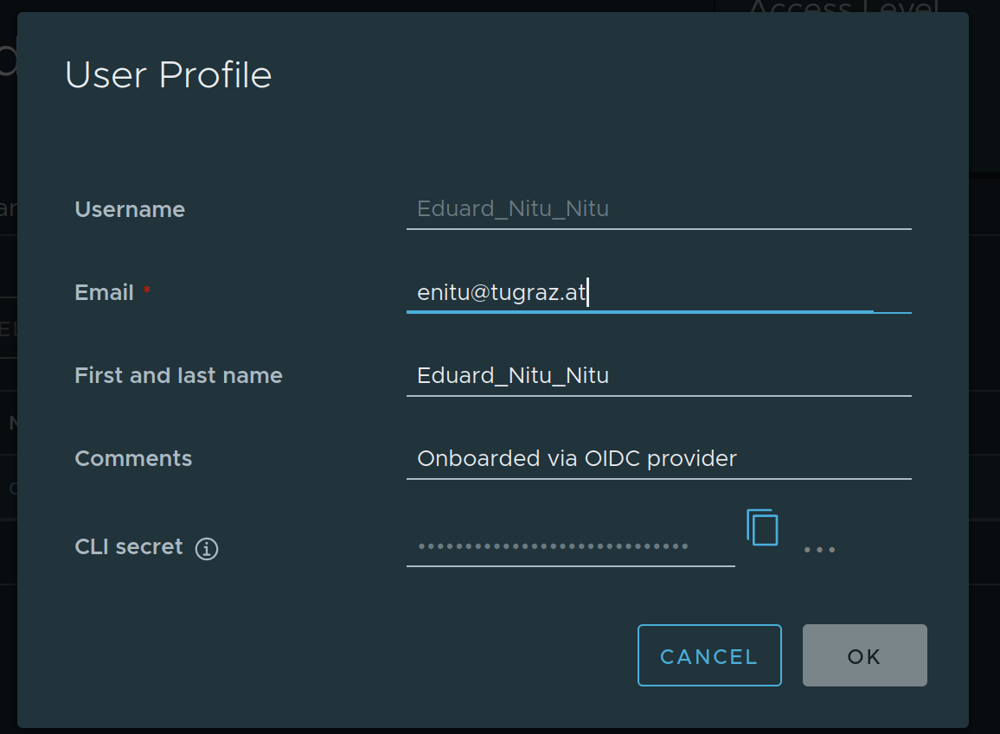

# Harbor

Harbor is an open source registry that secures artifacts with policies and role-based access control, ensures images are scanned and free from vulnerabilities.

This is a small guide for quick access to harbor docker image storage.

## harbor instance deployment
TODO

## harbor account

To have a Harbor account created, you need to login via SSO, which in our case is configured through Keycloak-OIDC.

Once you login via SSO, you will have a project and role automatically assigned.


## docker login and push
Once your account is created and configured in a project, you will need to use it to authenticate via docker.

```
docker login harbor.<your_domain>
```


After this you will be prompted to enter Username and password. In the **Harbor** browser page go to your user (top right) -> User profile. The password would be the **CLI Secret**. Copy that to clipboard.

Then:

```
docker tag <your_image> harbor.<your_domain>/<your_project>/<image_name>:<tag>
```

```
docker push harbor.<your_domain>/<your_project>/<image_name>:<tag>
```

Check in the Harbor website whether your image was pushed correctly to the desired project.

**Note**: Additional docs for docker authentication https://docs.docker.com/desktop/setup/sign-in/