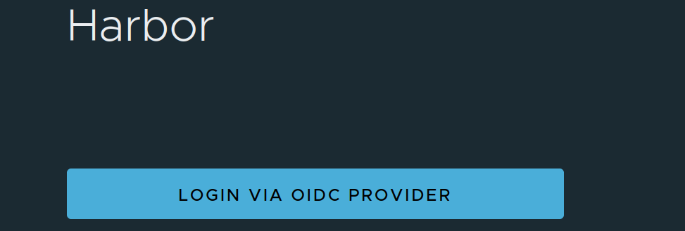

# Harbor Registry — Push Image Guide

## Overview

[Harbor](https://goharbor.io/) is an open-source container registry that provides:

- **Role-Based Access Control (RBAC)**
- **Integration with SSO / OIDC** (via Keycloak)
- **Vulnerability scanning** and secure artifact storage

This guide shows you how to get started with Harbor, create your account via SSO, and push Docker images to your assigned project.

---

## 1. Getting a Harbor Account

1. Go to the **Harbor Web Interface**

2. **Log in via SSO** (Keycloak OIDC) using your CyVerse Austria credentials.



3. After your first login, your **Harbor account** is automatically provisioned:
   - You’ll automatically get your designated **role** within that project (e.g. *Developer*, *Maintainer*).
---

## 2. Docker Login & Using Harbor

Once your account is ready, follow these steps to log in and push your images.

### Step 1: Log in via Docker CLI

```bash
docker login harbor.<your_domain>
```

You’ll be prompted for **username** and **password**.

* **Username:** Your Harbor username (same as your Keycloak username)

* **Password:** Use your CLI secret (not your Keycloak password)

To find your CLI secret:

* Log into the Harbor UI

* Click your **user profile** (top right corner)

* Go to User Profile → **CLI Secret**

* Copy and use it when prompted for your password


### Step 2: Tag Your Image

Replace the placeholders with your project and image name:

```bash
docker tag <your_image> harbor.<your_domain>/<your_project>/<image_name>:<tag>
```

### Step 3: Push Your Image
```bash
docker push harbor.<your_domain>/<your_project>/<image_name>:<tag>
```
