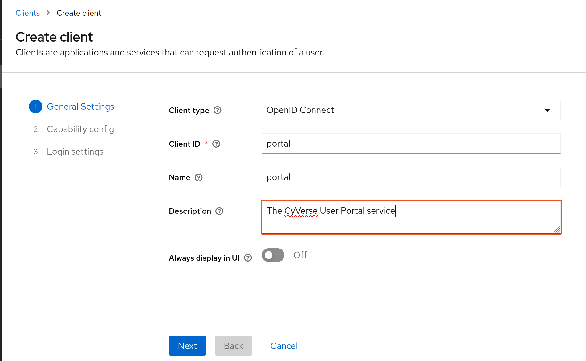
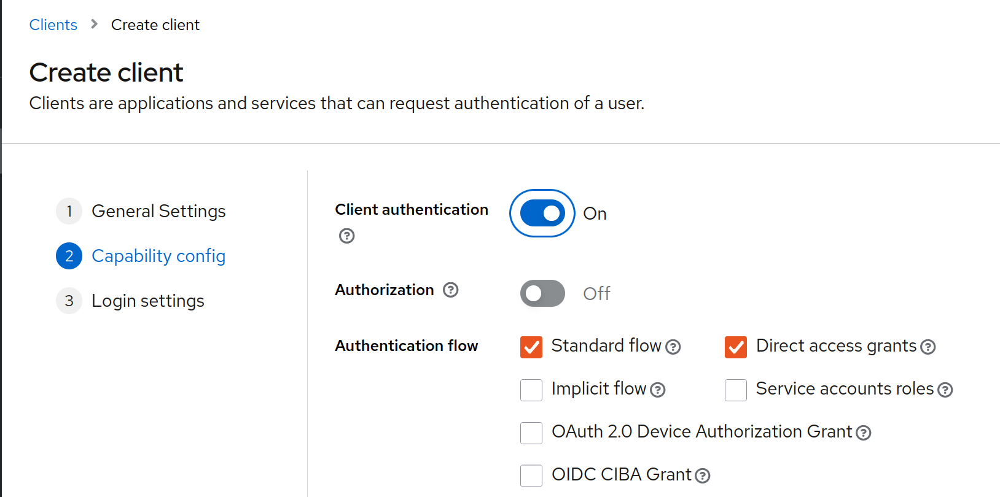
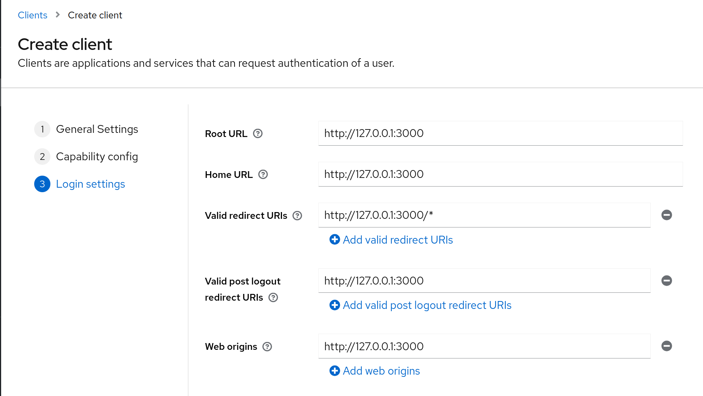

# Keycloak client setup

Connecting any CyVerse service to Keycloak for registration and authentication requieres creating a **client** for that service in Keycloak.

Go to your Keycloak instance -> your working realm -> Clients.

Here you can either:

- Import an already existing client through a JSON file.
- Create a new client

Choose the clientID based on the configured CyVerse service, for example **portal**.

For production setups, it is recommended to have **Cient authentication** enabled.

For URLs setup, all configs could be the **hostname** of your service, apart from **Valid redirect URIs**, which could contain a wildcard, or the entire callback URI. For now we can configure it with wildcard.

The example in this screenshot is for configuring a CyVerse User portal service which runs locally on port 3000.

