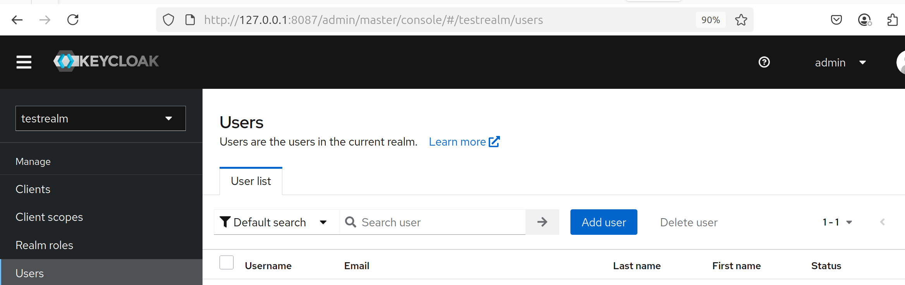

# Keycloak setup for User Portal
## Note: this guide is intended for local development.

Make sure you have PostgreSQL running as database and Keycloak deployed.

### Example Keycloak deployment using docker-compose.

```
services:
  ...

  keycloak:
    image: bitnami/keycloak:23
    pull_policy: always
    restart: unless-stopped
    environment:
      KEYCLOAK_ADMIN: admin
      KEYCLOAK_ADMIN_PASSWORD: admin
      KEYCLOAK_DATABASE_HOST: db
      KEYCLOAK_DATABASE_NAME: keycloak
      KEYCLOAK_DATABASE_USER: keycloak
      KEYCLOAK_DATABASE_PORT: 5432
      KEYCLOAK_DATABASE_PASSWORD: keycloak
    ports:
      - "8087:8080"
```

### Setup database for Keycloak: [Setup DB for Keycloak](https://cyverse-austria.github.io/docs/database/keycloak-db)


### Setup portal client in Keycloak

Once the container runs without errors:

- Access [keycloak-server](http://127.0.0.1:8087)
- Enter _Administration console_
- Create a new realm
- Create a new [client](../clients/clients.md) with id **portal**
- Go to the newly created client and get the Client secret
- Configure .env file with the new values
    ```
    KEYCLOAK_REALM="your_new_realm"
    KEYCLOAK_AUTH_URL="http://127.0.0.1:8087/"
    KEYCLOAK_CLIENT="portal"
    KEYCLOAK_SECRET="<your_client_secret>"
    ```

### Add new users

Using the Keycloak's _Administration console_, add new users that can then login to access the User Portal. 


