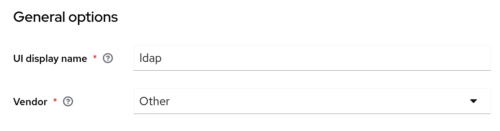
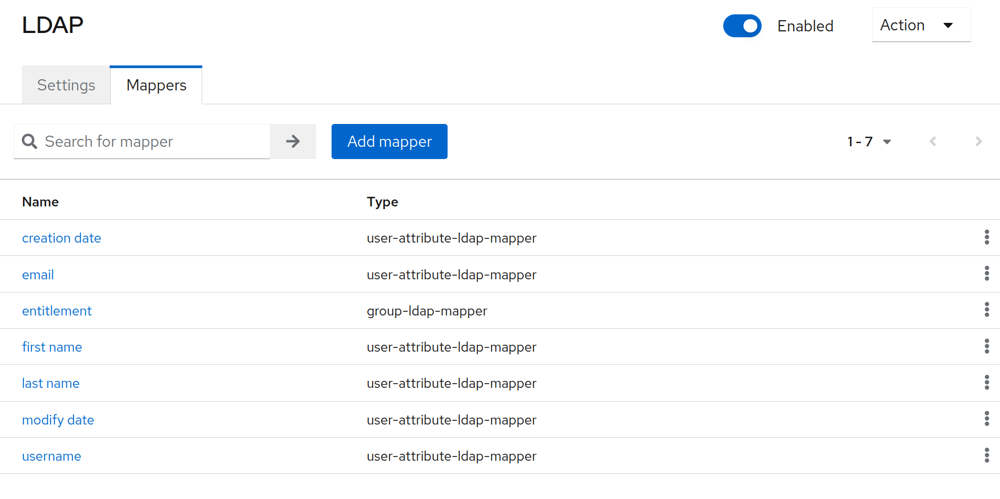
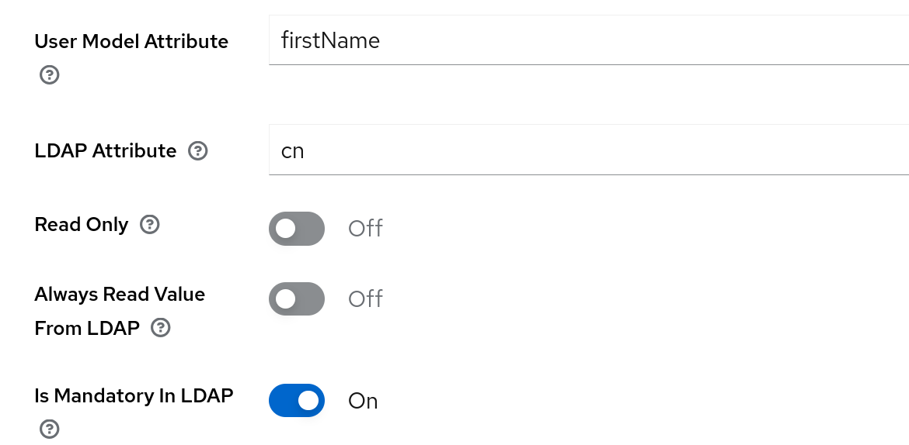

# User federation setup in Keycloak

## LDAP

An LDAP User storage can be configured as a User federation in Keycloak.

In your Keycloak instance go to: your working realm -> User federation -> Add LDAP providers

Make sure to choose **the correct vendor**. In CyVerse Austria case, the _vendor_ is OpenLDAP, which in Keycloak would be the option: **Other**.

Depending on your authentication usecase, LDAP can be used in different configurations.

- READ_ONLY: Keycloak will update its database with the new users registered in LDAP, but new users that register through Keycloak won't be persisted in LDAP. Generally, when choosing this mode, there won't be a need to tweak any other default setting.

- WRITABLE: If Keycloak is the registration core for new users and the users have to be persisted in LDAP, this is the best option. Make sure to pair this mode with **Sync registration: ON** setting. Attributes that are written to LDAP can be controlled with **Mappers**.

For example, if you want to write the first-name from Keycloak's UserModel to LDAP, this would be the correct configuration:

**Test**

To test your LDAP User federation, go to your working realm -> Users

- READ test: search for a user registered in the LDAP server.
- WRITE test: Create a new user in Keycloak, then check if it has: _User federation: **ldap**_ link in its profile.

