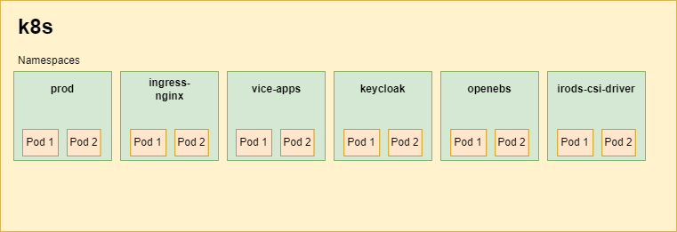

# Namespaces

List of namespaces used for CyVerse deployment in kubernetes.
**Note**: this documentation is relavant only for single/current environment.

## prod

This namespace is dedicated to the [core services](index.md#list-of-core-service) & some of non-core services such as :

* redis-ha
* redis-haproxy
* elasticsearch

Except the **irods-csi-driver** which runs in a specific namespace.

## ingress-nginx

This namespace is dedicated to the [ingress-nginx](https://docs.nginx.com/nginx-ingress-controller/) deployment.

## vice-apps

This namespace is dedicated to the [VICE](https://cyverse.org/node/50) related deployment and configurations.

## keycloak

This namespace is dedicated to Keycloak related deployment and configurations.

## openebs

This namespace is dedicated to the [openebs](https://openebs.io/) deployment.
OpenEBS turns any storage available on the Kubernetes worker nodes into local or distributed Kubernetes Persistent Volumes.

## irods-csi-driver

This namespace is dedicated to the [irods-csi-driver](https://github.com/cyverse/irods-csi-driver) deployment and configurations.
