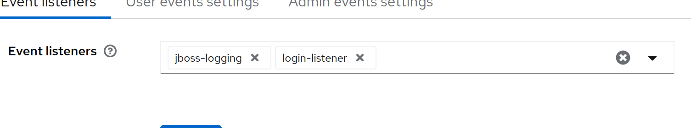
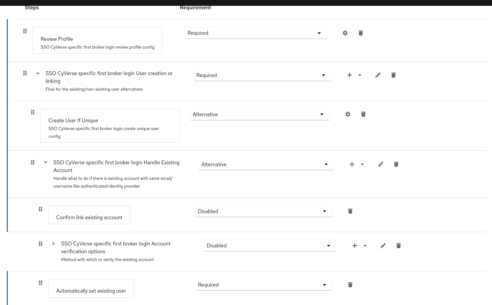
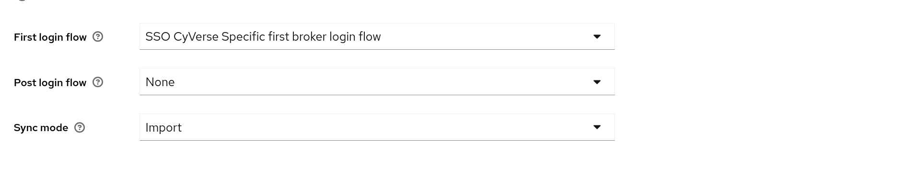

# Keycloak SSO Integration with LDAP and iRODS

This documentation provides a guide on how to set up Keycloak with Single Sign-On (SSO) integrated using TUG Identity Provider (IDP) and federated LDAP in a **read-only** configuration. Additionally, it explains the configuration for creating LDAP and iRODS accounts using a Keycloak event listener that triggers an API.

## Prerequisites

Before starting, make sure the following prerequisites are met:
- A working Keycloak instance.
- LDAP is configured and federated as **read-only**.
- iRODS account management API set up (see [CyVerse API Service](https://github.com/cyverse-austria/de-register/tree/main/api-service)).
- You have admin access to your Keycloak instance to configure event listeners and authentication flows.

---

## 1. Setting Up Keycloak Event Listener for LDAP and iRODS Account Creation

To automate the process of creating LDAP and iRODS accounts when a new user is registered via SSO, you need to configure a Keycloak event listener that triggers the necessary API.

### Configuration Steps:

1. **Download and Configure Event Listener**:
   - Clone the Keycloak event listener repository from [CyVerse Event Listener GitHub](https://github.com/cyverse-austria/de-register/tree/main/event-listener).
   - Build and deploy the event listener to your Keycloak instance.

2. **Configure Keycloak to Use Event Listener**:
   - In the Keycloak Admin Console, go to **`Realm Settings` > `Events`**.
   - Under **`Event Listeners`**, add the event listener by selecting the custom listener that you configured in the previous step.

   

3. **Event Listener Configuration**:
   - The event listener will trigger on `REGISTER` events, and it will call the [API Service](https://github.com/cyverse-austria/de-register/tree/main/api-service) to create both LDAP and iRODS accounts for the user.

---

## 2. Configuring Login Flow to Avoid LDAP Password Prompt

In order to avoid the extra verification step that prompts users for their LDAP credentials upon login, a custom login flow must be created. This ensures that the user does not need to input LDAP credentials again if their account already exists in LDAP.

### Steps to Create a New Login Flow:

1. **Access Login Flow Configuration**:
   - In the Keycloak Admin Console, navigate to **`Authentication`** > **`Flows`**.
   - Create a new flow or dublicate the existing flow.

2. **Configure the Flow**:
   - Disable CyVerse specific first broker login Account
   - Make sure to add the **Automatically set existing user: Required** step inside _Handle existing account_ flow. Add this step by clicking the **+** icon of the _Handle existing account flow_.
   
   

---

## 3. Use the Custom Authentication Flow

Once you have created the custom authentication flow, you need to ensure that your identity provider is using this flow for authentication.

### Steps to Choose the Custom Flow in Identity Provider Setup:

1. In the Keycloak Admin Console, navigate to **`Identity Providers`**.
2. Select the identity provider you want to configure (TUG IDP in this case).
3. In the **`Authentication Flow`** section, choose the custom flow you just created from the dropdown list.

   

## Conclusion

By following this guide, you have integrated Keycloak with LDAP and iRODS, ensuring smooth user account management through automated account creation triggered by the Keycloak event listener. This setup avoids the need for users to input their LDAP credentials on login and streamlines the authentication process.

For more information or to troubleshoot specific issues, refer to the [CyVerse API Service Documentation](https://github.com/cyverse-austria/de-register).